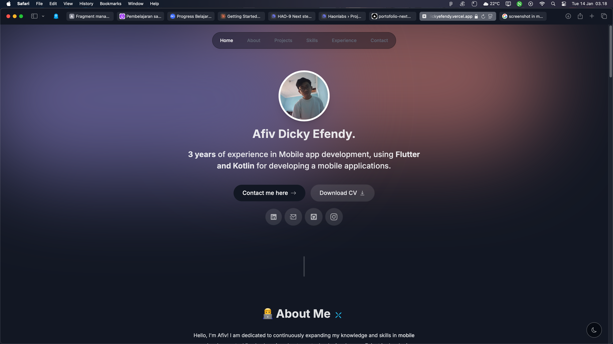

# Portfolio Website

## Description

This repository contains the codebase for my personal portfolio website, built using Next.js, Tailwind CSS, and Framer Motion. The website aims to showcase my projects, works, and experiences across various domains. With an appealing layout and smooth animations, the website is designed to provide an engaging experience for visitors.

## Key Features

- **Responsive Design:** The website has been designed with a responsive layout, allowing visitors to explore my portfolio seamlessly across various devices.

- **Smooth Animations:** Leveraging Framer Motion, the website incorporates captivating and fluid animations on select elements throughout the site, enhancing the visual impression.

- **Intuitive Navigation:** Clear and intuitive navigation assists visitors in easily navigating through different sections of the portfolio, including individual projects, the About Me page, and contact information.

- **Detailed Project Sections:** Each project within the portfolio has a dedicated detailed page that explains its purpose, my contributions, and achieved outcomes. This aids visitors in comprehending projects comprehensively.
